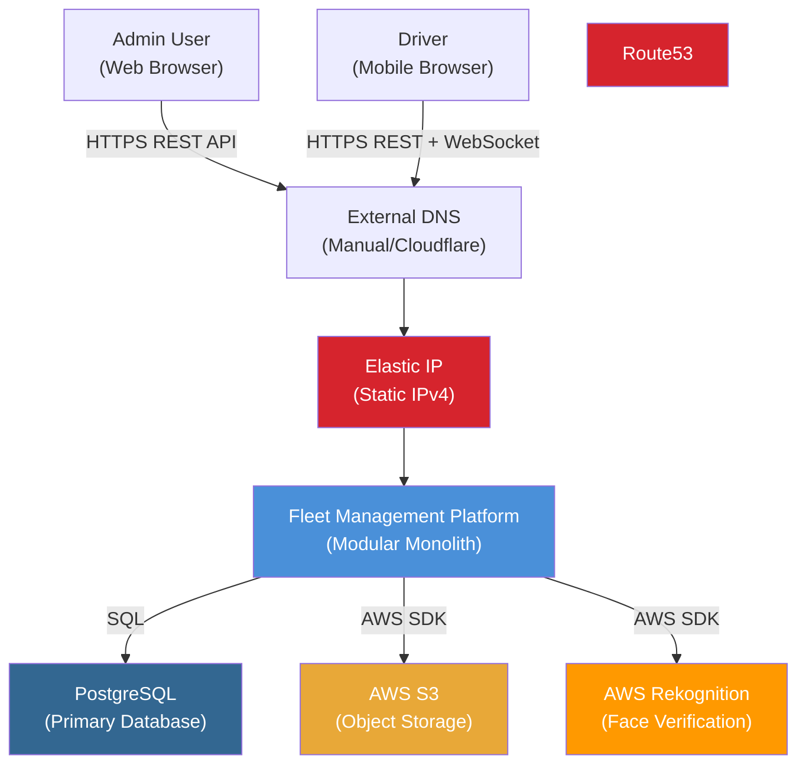
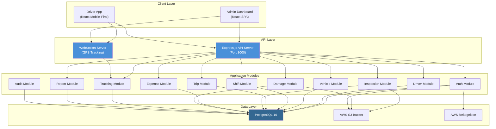
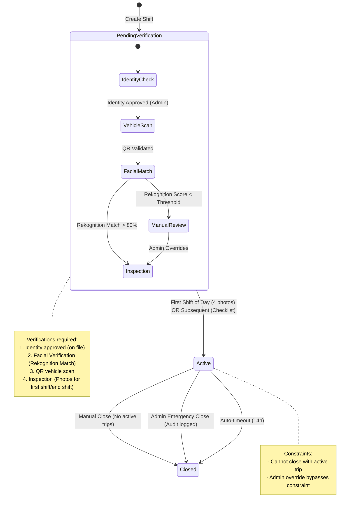
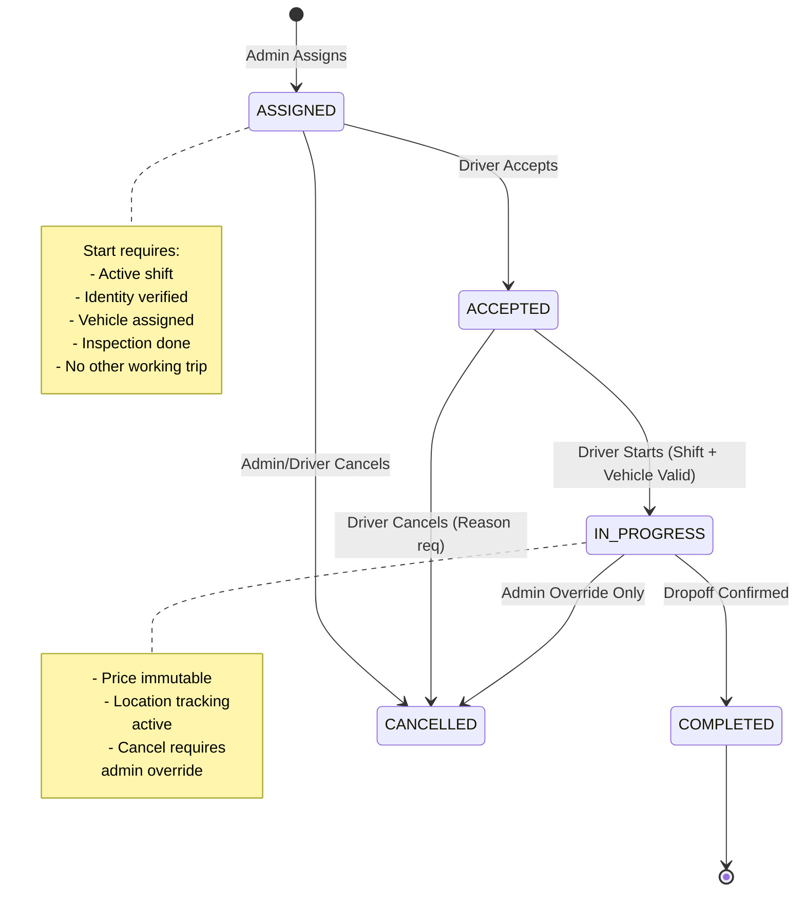
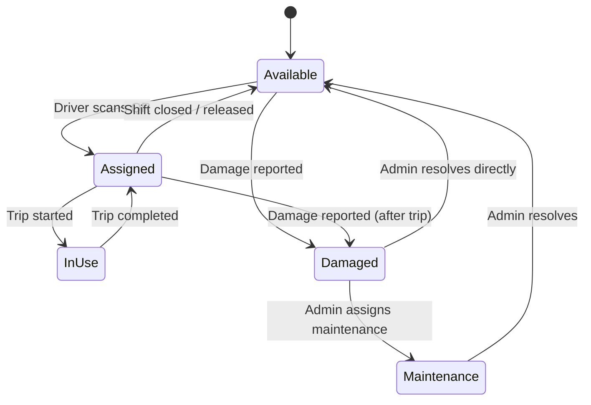
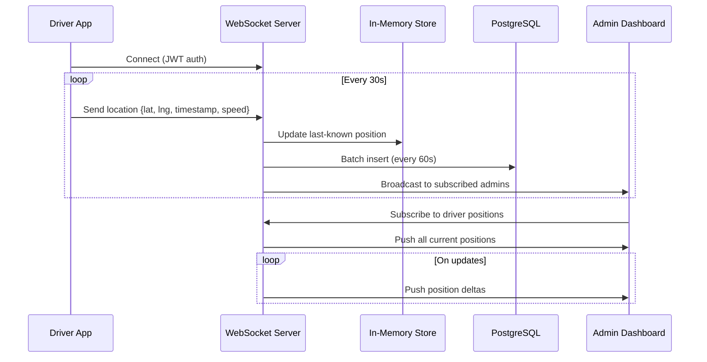

# Architecture Document — Sezar Drive

**Version:** 1.1  
**Author Role:** Solutions Architect  
**Date:** 2026-02-17  
**Status:** Approved  
**Input Artifacts:** `01-strategy.md` v1.0, `02-prd.md` v1.2  

---

## 1. Architecture Style: Modular Monolith

**Decision:** Modular Monolith over Microservices

**Justification:**

| Factor | Monolith | Microservices |
|--------|----------|---------------|
| Domain coupling | High (fleet ops is cohesive) | Unnecessary isolation |
| Team size | Small (1-3 devs) | Overhead unjustified |
| Operational complexity | Low | High (service mesh, distributed tracing) |
| Data consistency | ACID transactions easy | Saga pattern complexity |
| Future extraction | Module boundaries allow it | Already separate |

Modules are internally isolated with clear interfaces, enabling future microservice extraction if the team grows.

---

## 2. System Context (C4 Level 1)



---

## 3. Container Diagram (C4 Level 2)



---

## 4. Module Decomposition

| Module | Responsibility | Dependencies |
|--------|---------------|--------------|
| **Auth** | JWT login, password reset, identity photo upload | Audit |
| **Driver** | Driver CRUD, identity approval | Auth, Audit |
| **Vehicle** | Vehicle CRUD, QR management, assignment | Audit |
| **Shift** | Shift state machine, concurrency control | Auth, Vehicle, Inspection, Audit |
| **Trip** | Trip state machine, assignment, price immutability | Shift, Vehicle, Audit |
| **Inspection** | Photo upload, checklist, policy enforcement | Vehicle, Shift, Audit |
| **Expense** | Expense CRUD, approval workflow, categories | Shift, Audit |
| **Damage** | Damage reports, vehicle locking | Vehicle, Trip, Audit |
| **Tracking** | GPS location updates, WebSocket broadcast, history | Driver, Audit |
| **Report** | PDF/Excel generation, revenue aggregation | Trip, Expense, Driver |
| **Audit** | Immutable logging, query interface | None (leaf module) |

---

## 5. State Machine Definitions

### 5.1 Shift State Machine



**Transition Table:**

| From | To | Trigger | Guard Conditions | Side Effects |
|------|-----|---------|-----------------|--------------|
| — | PendingVerification | `createShift()` | No active shift exists, identity verified | Audit log |
| PendingVerification | Active | `activateShift()` | Identity approved, Face verified (Rekognition Match), QR validated, inspection complete | Audit log |
| Active | Closed | `closeShift()` | No active trip | Release vehicle, 4-photo inspection, audit log |
| Active | Closed | `adminCloseShift()` | Admin role | Force-complete trip if exists, release vehicle, audit log |
| Active | Closed | `autoTimeout()` | Timer exceeded | Same as admin close |

---

### 5.2 Trip State Machine



**Transition Table:**

| From | To | Trigger | Guard Conditions | Side Effects |
|------|-----|---------|-----------------|--------------|
| — | ASSIGNED | `assignTrip()` | Valid driver, admin role | Audit log |
| ASSIGNED | ACCEPTED | `acceptTrip()` | Assigned driver | Audit log |
| ACCEPTED | IN_PROGRESS | `startTrip()` | Active shift, identity ok, vehicle ok, inspection ok, no working trip | Lock price, audit log |
| ASSIGNED | CANCELLED | `cancelTrip()` | Admin or assigned driver | Audit log |
| IN_PROGRESS | COMPLETED | `completeTrip()` | Driver confirms | Record actual end time, audit log |
| IN_PROGRESS | CANCELLED | `adminCancelTrip()` | Admin override | Audit log with override reason |

---

### 5.3 Vehicle Status Model



---

## 6. API Design

### 6.1 Base URL Structure

```
/api/v1/auth/*          — Authentication
/api/v1/drivers/*       — Driver management
/api/v1/vehicles/*      — Vehicle management
/api/v1/shifts/*        — Shift lifecycle
/api/v1/trips/*         — Trip lifecycle
/api/v1/inspections/*   — Inspection workflow
/api/v1/expenses/*      — Expense management
/api/v1/damage-reports/* — Damage reporting
/api/v1/tracking/*      — GPS tracking (REST)
/api/v1/reports/*       — Report generation
/api/v1/stats/*         — Dashboard visualization data
/api/v1/verify/*        — Identity and Rekognition
/api/v1/audit-logs/*    — Audit log query
/ws/tracking            — WebSocket (real-time GPS)
```

### 6.2 Authentication Scheme

- JWT access token (15 min expiry)
- JWT refresh token (7 day expiry, stored in DB)
- Bearer token in `Authorization` header
- Refresh endpoint: `POST /api/v1/auth/refresh`

### 6.3 Error Model

```json
{
  "error": {
    "code": "INVALID_STATE_TRANSITION",
    "message": "Cannot start trip: no active shift exists",
    "details": {
      "current_state": null,
      "attempted_transition": "start",
      "missing_preconditions": ["active_shift"]
    }
  }
}
```

**Standard Error Codes:**

| HTTP | Code | Usage |
|------|------|-------|
| 400 | VALIDATION_ERROR | Input validation failure |
| 401 | UNAUTHORIZED | Missing/invalid token |
| 403 | FORBIDDEN | Insufficient role / MUST_CHANGE_PASSWORD / IDENTITY_NOT_VERIFIED |
| 404 | NOT_FOUND | Resource not found |
| 409 | CONFLICT | State machine violation / uniqueness violation |
| 413 | PAYLOAD_TOO_LARGE | File upload exceeds limit |
| 429 | RATE_LIMITED | Too many requests |
| 500 | INTERNAL_ERROR | Server error |

---

## 7. Concurrency Control

**Strategy:** Optimistic Locking with version fields

- Each stateful entity (shift, trip, vehicle_assignment) has a `version` column
- State transitions include `WHERE version = expected_version`
- If affected rows = 0 → 409 Conflict
- PostgreSQL advisory locks for critical sections (shift creation check)

**Critical Invariants Enforced at DB Level:**

```sql
-- One active shift per driver
CREATE UNIQUE INDEX idx_one_active_shift_per_driver 
ON shifts (driver_id) WHERE status IN ('PendingVerification', 'Active');

-- One active trip per driver  
CREATE UNIQUE INDEX idx_one_working_trip_per_driver 
ON trips (driver_id) WHERE status IN ('ASSIGNED', 'ACCEPTED', 'IN_PROGRESS');

-- One active driver per vehicle
CREATE UNIQUE INDEX idx_one_active_driver_per_vehicle 
ON vehicle_assignments (vehicle_id) WHERE active = true;
```

---

## 8. Security Model

### 8.1 RBAC Matrix

| Resource | Admin | Driver |
|----------|-------|--------|
| Create driver | ✅ | ❌ |
| View own profile | ✅ | ✅ |
| Approve identity | ✅ | ❌ |
| Manage vehicles | ✅ | ❌ |
| Create shift | ✅ | ✅ (own) |
| Assign trip | ✅ | ❌ |
| Start/complete trip | ❌ | ✅ (own) |
| Submit expense | ❌ | ✅ (own) |
| Approve expense | ✅ | ❌ |
| View tracking | ✅ | ❌ |
| Generate reports | ✅ | ❌ |
| View audit logs | ✅ | ❌ |
| Override state | ✅ | ❌ |

### 8.2 Security Measures

- Passwords hashed with bcrypt (12 rounds)
- JWT signed with RS256 or HS256 (configurable)
- HTTPS enforced in production
- File uploads validated (type, size, content-type sniffing)
- SQL injection prevented by Prisma ORM parameterization
- Rate limiting on auth endpoints (5 attempts per minute)
- CORS configured per environment
- Input validation via express-validator on all endpoints

---

## 9. Failure Handling Design

| Failure | Detection | Recovery | Data Impact |
|---------|-----------|----------|-------------|
| **Identity photo upload fails** | HTTP error / timeout | Client retries with exponential backoff | No state change until success |
| **Network loss during trip** | Client heartbeat timeout | Trip state preserved server-side; resume on reconnect | GPS gap acceptable |
| **Driver app crash** | No explicit detection | App reopens → fetches active shift/trip state → resumes | No data loss |
| **GPS tracking outage** | WebSocket disconnect | Core ops continue; tracking resumes on reconnect | Last-known location persists |
| **Admin reassignment mid-shift** | Explicit admin action | Previous assignment ended with audit; new assignment begins | Full audit trail |
| **DB connection failure** | Connection pool error | Retry with circuit breaker (3 attempts, 1s backoff) | Request fails gracefully |
| **File storage failure** | I/O error | Return 503; inspection/damage requires retry | No partial state change |

---

## 10. GPS Tracking Architecture



- Location updates batched and written to DB every 60 seconds
- Last-known position kept in memory for instant map display
- Location history queryable per shift/trip for route replay
- WebSocket auth via JWT token in connection handshake

---

## Change Log

| Version | Date | Change | Author |
|---------|------|--------|--------|
| 1.0 | 2026-02-14 | Initial architecture | Solutions Architect |
| 1.1 | 2026-02-17 | Updated Shift/Trip states, Rekognition flow, and API mapping | Solutions Architect |
| 1.2 | 2026-02-21 | Added Elastic IP for stable connectivity | Solutions Architect |
| 1.3 | 2026-02-21 | Removed Route 53 to stay in Free Tier; shifted to External DNS | Solutions Architect |
