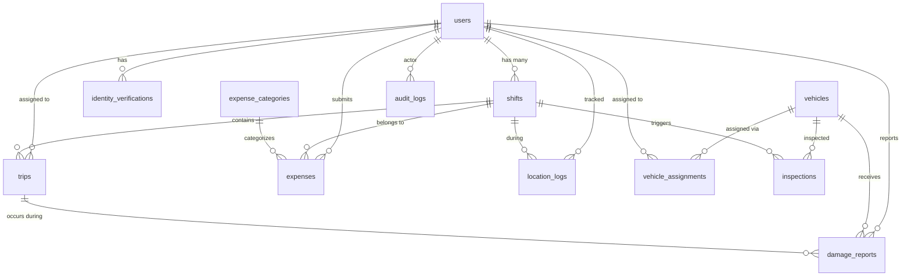

# Database Schema — Fleet Transportation & Trip Management Platform

**Version:** 1.1  
**Author Role:** Database Administrator  
**Date:** 2026-02-17  
**Status:** Approved  
**Input Artifacts:** `02-prd.md` v1.2, `03-architecture.md` v1.1  

---

## 1. Entity Relationship Overview



---

## 2. Tables

### 2.1 users
| Column | Type | Constraints | Description |
|--------|------|-------------|-------------|
| id | UUID | PK, DEFAULT gen_random_uuid() | Primary key |
| email | VARCHAR(255) | UNIQUE, NOT NULL | Login email |
| phone | VARCHAR(20) | UNIQUE, NOT NULL | Phone number |
| password_hash | VARCHAR(255) | NOT NULL | bcrypt hash |
| name | VARCHAR(255) | NOT NULL | Full name |
| role | VARCHAR(20) | NOT NULL, CHECK (role IN ('admin','driver')) | RBAC role |
| license_number | VARCHAR(50) | UNIQUE, nullable | Driver license (required for drivers) |
| must_change_password | BOOLEAN | NOT NULL, DEFAULT true | Force password change |
| identity_verified | BOOLEAN | NOT NULL, DEFAULT false | Admin approved identity |
| identity_photo_url | VARCHAR(500) | nullable | Reference identity photo in S3 |
| id_card_front | VARCHAR(500) | nullable | Driver ID Front in S3 |
| id_card_back | VARCHAR(500) | nullable | Driver ID Back in S3 |
| avatar_url | VARCHAR(500) | nullable | Personal profile photo in S3 |
| language_preference | VARCHAR(10) | NOT NULL, DEFAULT 'en' | User interface language |
| last_known_lat | DECIMAL(10,7) | nullable | GPS latitude |
| last_known_lng | DECIMAL(10,7) | nullable | GPS longitude |
| last_location_at | TIMESTAMPTZ | nullable | GPS timestamp |
| is_active | BOOLEAN | NOT NULL, DEFAULT true | Soft delete |
| version | INTEGER | NOT NULL, DEFAULT 1 | Optimistic lock |
| created_at | TIMESTAMPTZ | NOT NULL, DEFAULT NOW() | |
| updated_at | TIMESTAMPTZ | NOT NULL, DEFAULT NOW() | |

### 2.2 refresh_tokens
| Column | Type | Constraints | Description |
|--------|------|-------------|-------------|
| id | UUID | PK | |
| user_id | UUID | FK → users(id), NOT NULL | |
| token_hash | VARCHAR(255) | NOT NULL | Hashed refresh token |
| expires_at | TIMESTAMPTZ | NOT NULL | |
| revoked | BOOLEAN | NOT NULL, DEFAULT false | |
| created_at | TIMESTAMPTZ | NOT NULL, DEFAULT NOW() | |

### 2.3 identity_verifications
| Column | Type | Constraints | Description |
|--------|------|-------------|-------------|
| id | UUID | PK | |
| driver_id | UUID | FK → users(id), NOT NULL | |
| photo_url | VARCHAR(500) | NOT NULL | Face verification photo |
| id_card_front | VARCHAR(500) | nullable | ID Card Front |
| id_card_back | VARCHAR(500) | nullable | ID Card Back |
| status | VARCHAR(20) | NOT NULL, CHECK (status IN ('pending','approved','rejected')) | |
| reviewed_by | UUID | FK → users(id), nullable | Admin who reviewed |
| rejection_reason | TEXT | nullable | |
| created_at | TIMESTAMPTZ | NOT NULL, DEFAULT NOW() | |
| reviewed_at | TIMESTAMPTZ | nullable | |

### 2.4 vehicles
| Column | Type | Constraints | Description |
|--------|------|-------------|-------------|
| id | UUID | PK | |
| plate_number | VARCHAR(20) | UNIQUE, NOT NULL | |
| model | VARCHAR(100) | NOT NULL | |
| year | INTEGER | NOT NULL | |
| capacity | INTEGER | NOT NULL, DEFAULT 4 | |
| qr_code | VARCHAR(255) | UNIQUE, NOT NULL | QR identifier |
| status | VARCHAR(20) | NOT NULL, DEFAULT 'available', CHECK (status IN ('available','assigned','in_use','damaged','maintenance')) | |
| is_active | BOOLEAN | NOT NULL, DEFAULT true | Soft delete |
| version | INTEGER | NOT NULL, DEFAULT 1 | |
| created_at | TIMESTAMPTZ | NOT NULL, DEFAULT NOW() | |
| updated_at | TIMESTAMPTZ | NOT NULL, DEFAULT NOW() | |

### 2.5 vehicle_assignments
| Column | Type | Constraints | Description |
|--------|------|-------------|-------------|
| id | UUID | PK | |
| vehicle_id | UUID | FK → vehicles(id), NOT NULL | |
| driver_id | UUID | FK → users(id), NOT NULL | |
| shift_id | UUID | FK → shifts(id), NOT NULL | |
| active | BOOLEAN | NOT NULL, DEFAULT true | |
| assigned_at | TIMESTAMPTZ | NOT NULL, DEFAULT NOW() | |
| released_at | TIMESTAMPTZ | nullable | |

**Partial Unique Index:**
```sql
CREATE UNIQUE INDEX idx_one_active_driver_per_vehicle 
ON vehicle_assignments (vehicle_id) WHERE active = true;

CREATE UNIQUE INDEX idx_one_active_vehicle_per_driver 
ON vehicle_assignments (driver_id) WHERE active = true;
```

### 2.6 shifts
| Column | Type | Constraints | Description |
|--------|------|-------------|-------------|
| id | UUID | PK | |
| driver_id | UUID | FK → users(id), NOT NULL | |
| vehicle_id | UUID | FK → vehicles(id), nullable | Set after QR scan |
| status | VARCHAR(20) | NOT NULL, DEFAULT 'PendingVerification', CHECK (status IN ('PendingVerification','Active','Closed')) | |
| started_at | TIMESTAMPTZ | nullable | When shift became Active |
| closed_at | TIMESTAMPTZ | nullable | |
| close_reason | VARCHAR(50) | nullable | 'driver_closed','admin_override','auto_timeout' |
| version | INTEGER | NOT NULL, DEFAULT 1 | |
| created_at | TIMESTAMPTZ | NOT NULL, DEFAULT NOW() | |
| start_selfie_url | VARCHAR(500) | nullable | Live selfie from Rekognition attempt |
| verification_status | VARCHAR(20) | NOT NULL, DEFAULT 'PENDING' | PENDING, VERIFIED, REJECTED, etc. |

**Partial Unique Index:**
```sql
CREATE UNIQUE INDEX idx_one_active_shift_per_driver 
ON shifts (driver_id) WHERE status IN ('PendingVerification', 'Active');
```

### 2.7 trips
| Column | Type | Constraints | Description |
|--------|------|-------------|-------------|
| id | UUID | PK | |
| driver_id | UUID | FK → users(id), NOT NULL | |
| shift_id | UUID | FK → shifts(id), NOT NULL | |
| vehicle_id | UUID | FK → vehicles(id), NOT NULL | |
| status | VARCHAR(20) | NOT NULL, DEFAULT 'Assigned', CHECK (status IN ('Assigned','Started','Completed','Cancelled','OFFLINE_PENDING_SYNC')) | |
| pickup_location | VARCHAR(500) | NOT NULL | |
| dropoff_location | VARCHAR(500) | NOT NULL | |
| scheduled_time | TIMESTAMPTZ | nullable | |
| price | DECIMAL(10,2) | NOT NULL | Immutable after start |
| actual_start_time | TIMESTAMPTZ | nullable | |
| actual_end_time | TIMESTAMPTZ | nullable | |
| cancellation_reason | TEXT | nullable | |
| cancelled_by | UUID | FK → users(id), nullable | |
| version | INTEGER | NOT NULL, DEFAULT 1 | |
| created_at | TIMESTAMPTZ | NOT NULL, DEFAULT NOW() | |
| updated_at | TIMESTAMPTZ | NOT NULL, DEFAULT NOW() | |

**Partial Unique Index:**
```sql
CREATE UNIQUE INDEX idx_one_active_trip_per_driver 
ON trips (driver_id) WHERE status IN ('Assigned', 'Started');
```

### 2.8 inspections
| Column | Type | Constraints | Description |
|--------|------|-------------|-------------|
| id | UUID | PK | |
| shift_id | UUID | FK → shifts(id), NOT NULL | |
| vehicle_id | UUID | FK → vehicles(id), NOT NULL | |
| driver_id | UUID | FK → users(id), NOT NULL | |
| type | VARCHAR(20) | NOT NULL, CHECK (type IN ('full','checklist')) | |
| status | VARCHAR(20) | NOT NULL, DEFAULT 'pending', CHECK (status IN ('pending','completed')) | |
| mileage | INTEGER | nullable | |
| checklist_data | JSONB | nullable | Post-trip checklist items |
| created_at | TIMESTAMPTZ | NOT NULL, DEFAULT NOW() | |
| completed_at | TIMESTAMPTZ | nullable | |

### 2.9 inspection_photos
| Column | Type | Constraints | Description |
|--------|------|-------------|-------------|
| id | UUID | PK | |
| inspection_id | UUID | FK → inspections(id), NOT NULL | |
| direction | VARCHAR(10) | NOT NULL, CHECK (direction IN ('front','back','left','right')) | |
| photo_url | VARCHAR(500) | NOT NULL | |
| uploaded_at | TIMESTAMPTZ | NOT NULL, DEFAULT NOW() | |

### 2.10 expense_categories
| Column | Type | Constraints | Description |
|--------|------|-------------|-------------|
| id | UUID | PK | |
| name | VARCHAR(100) | UNIQUE, NOT NULL | e.g. Fuel, Parking, Tolls |
| is_active | BOOLEAN | NOT NULL, DEFAULT true | |
| requires_approval | BOOLEAN | NOT NULL, DEFAULT false | |
| created_at | TIMESTAMPTZ | NOT NULL, DEFAULT NOW() | |

### 2.11 expenses
| Column | Type | Constraints | Description |
|--------|------|-------------|-------------|
| id | UUID | PK | |
| shift_id | UUID | FK → shifts(id), NOT NULL | |
| driver_id | UUID | FK → users(id), NOT NULL | |
| category_id | UUID | FK → expense_categories(id), NOT NULL | |
| amount | DECIMAL(10,2) | NOT NULL, CHECK (amount > 0) | |
| description | TEXT | nullable | |
| receipt_url | VARCHAR(500) | nullable | |
| status | VARCHAR(20) | NOT NULL, DEFAULT 'pending', CHECK (status IN ('pending','approved','rejected')) | |
| reviewed_by | UUID | FK → users(id), nullable | |
| reviewed_at | TIMESTAMPTZ | nullable | |
| rejection_reason | TEXT | nullable | |
| created_at | TIMESTAMPTZ | NOT NULL, DEFAULT NOW() | |
| updated_at | TIMESTAMPTZ | NOT NULL, DEFAULT NOW() | |

### 2.12 damage_reports
| Column | Type | Constraints | Description |
|--------|------|-------------|-------------|
| id | UUID | PK | |
| vehicle_id | UUID | FK → vehicles(id), NOT NULL | |
| driver_id | UUID | FK → users(id), NOT NULL | |
| trip_id | UUID | FK → trips(id), nullable | |
| shift_id | UUID | FK → shifts(id), NOT NULL | |
| description | TEXT | NOT NULL | |
| status | VARCHAR(20) | NOT NULL, DEFAULT 'reported', CHECK (status IN ('reported','acknowledged','maintenance','resolved')) | |
| reviewed_by | UUID | FK → users(id), nullable | |
| resolved_at | TIMESTAMPTZ | nullable | |
| created_at | TIMESTAMPTZ | NOT NULL, DEFAULT NOW() | |
| updated_at | TIMESTAMPTZ | NOT NULL, DEFAULT NOW() | |

### 2.13 damage_photos
| Column | Type | Constraints | Description |
|--------|------|-------------|-------------|
| id | UUID | PK | |
| damage_report_id | UUID | FK → damage_reports(id), NOT NULL | |
| photo_url | VARCHAR(500) | NOT NULL | |
| uploaded_at | TIMESTAMPTZ | NOT NULL, DEFAULT NOW() | |

### 2.14 location_logs
| Column | Type | Constraints | Description |
|--------|------|-------------|-------------|
| id | UUID | PK | |
| driver_id | UUID | FK → users(id), NOT NULL | |
| shift_id | UUID | FK → shifts(id), nullable | |
| trip_id | UUID | FK → trips(id), nullable | |
| latitude | DECIMAL(10,7) | NOT NULL | |
| longitude | DECIMAL(10,7) | NOT NULL | |
| speed | DECIMAL(6,2) | nullable | km/h |
| recorded_at | TIMESTAMPTZ | NOT NULL | Device timestamp |
| created_at | TIMESTAMPTZ | NOT NULL, DEFAULT NOW() | Server timestamp |

**Index:** `CREATE INDEX idx_location_logs_driver_time ON location_logs (driver_id, recorded_at);`

### 2.15 audit_logs
| Column | Type | Constraints | Description |
|--------|------|-------------|-------------|
| id | UUID | PK | |
| actor_id | UUID | FK → users(id), NOT NULL | Who performed action |
| action_type | VARCHAR(50) | NOT NULL | e.g. 'shift.created', 'trip.started' |
| entity_type | VARCHAR(50) | NOT NULL | e.g. 'shift', 'trip', 'expense' |
| entity_id | UUID | NOT NULL | Reference to affected entity |
| previous_state | JSONB | nullable | State before change |
| new_state | JSONB | nullable | State after change |
| ip_address | VARCHAR(45) | nullable | |
| metadata | JSONB | nullable | Additional context |
| created_at | TIMESTAMPTZ | NOT NULL, DEFAULT NOW() | |

**Note:** This table is INSERT-ONLY. No UPDATE or DELETE operations at application level.

**Index:** `CREATE INDEX idx_audit_logs_entity ON audit_logs (entity_type, entity_id);`
**Index:** `CREATE INDEX idx_audit_logs_actor ON audit_logs (actor_id, created_at);`

### 2.16 admin_config
| Column | Type | Constraints | Description |
|--------|------|-------------|-------------|
| id | UUID | PK | |
| key | VARCHAR(100) | UNIQUE, NOT NULL | Config key |
| value | JSONB | NOT NULL | Config value |
| updated_by | UUID | FK → users(id) | |
| updated_at | TIMESTAMPTZ | NOT NULL, DEFAULT NOW() | |

**Seed config keys:** `shift_auto_timeout_hours`, `inspection_policy`, `tracking_interval_seconds`, `max_report_days`

---

## 3. Seed Data

```sql
-- Admin user (password set by your seed process)
INSERT INTO users (id, email, phone, password_hash, name, role, must_change_password, identity_verified)
VALUES ('...', 'admin@example.com', '+1000000000', '$bcrypt_hash', 'System Admin', 'admin', false, true);

-- Expense categories
INSERT INTO expense_categories (name, requires_approval) VALUES
('Fuel', false),
('Parking', false),
('Tolls', false),
('Maintenance', true),
('Other', true);

-- Admin config
INSERT INTO admin_config (key, value) VALUES
('shift_auto_timeout_hours', '14'),
('inspection_policy', '{"first_shift_of_day": "full", "subsequent_trips": "checklist", "damage_reported": "full", "vehicle_reassigned": "full"}'),
('tracking_interval_seconds', '30'),
('max_report_days', '90');
```

---

## Change Log

| Version | Date | Change | Author |
|---------|------|--------|--------|
| 1.0 | 2026-02-14 | Initial schema | Database Administrator |
| 1.1 | 2026-02-17 | Synced with schema.prisma: added identity fields, language, and validation states | Database Administrator |
